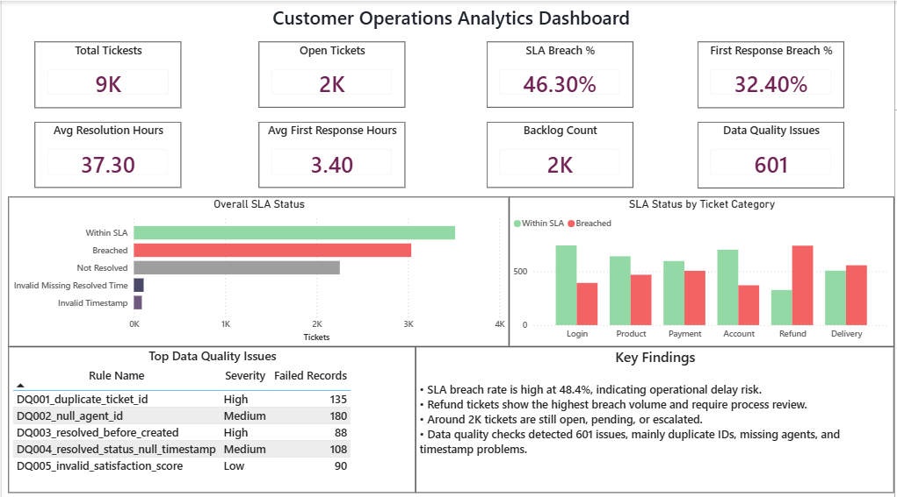
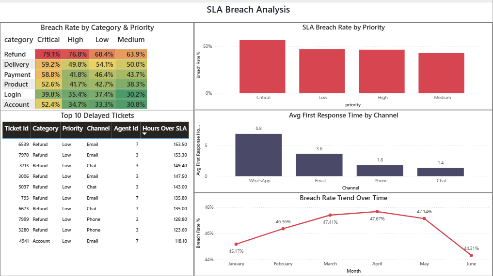
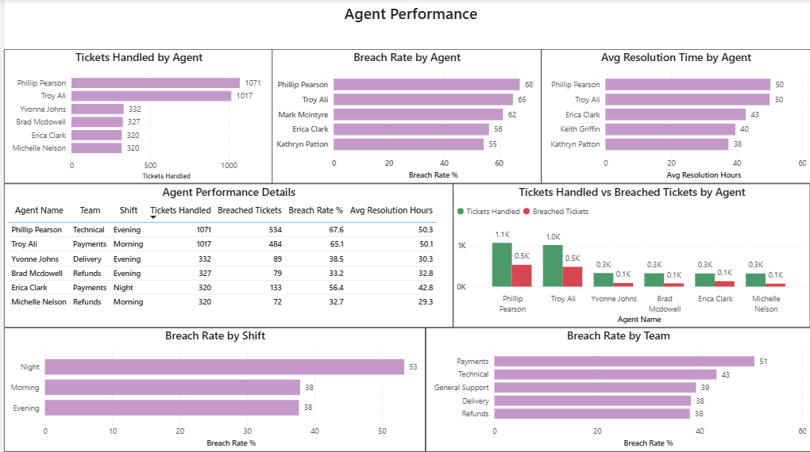
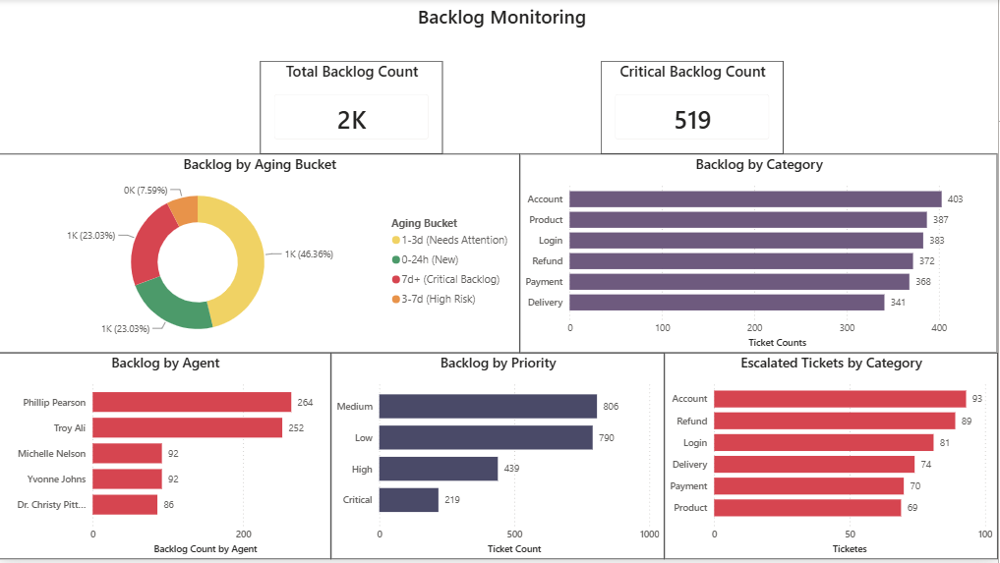

# Customer Operations Analytics Dashboard

> End-to-end Customer Operations Analytics solution built using **Python, SQL Server, and Power BI** to monitor SLA performance, agent productivity, backlog, and data quality for a customer support operation.

---

# Project Overview

Customer support teams generate thousands of service tickets every month. Delays in responding to customers, unresolved backlogs, uneven agent workloads, and poor data quality can significantly affect customer satisfaction and operational efficiency.

This project simulates a real-world customer support environment by generating synthetic operational data, processing it through SQL Server, and building an interactive Power BI dashboard to identify operational bottlenecks and support business decision-making.

The dashboard helps answer questions such as:

- Which ticket categories breach SLA most frequently?
- Which agents are overloaded?
- Which teams or shifts require additional staffing?
- Where is backlog accumulating?
- What data quality issues exist in operational records?

---

# Business Problem

A customer operations team observed:

- Increasing SLA breaches
- Growing unresolved backlog
- Uneven ticket distribution among agents
- Inconsistent data quality
- Difficulty identifying operational bottlenecks

The objective was to design a reporting solution that provides actionable insights for operations managers.

---

# Solution Architecture

```
Python (Synthetic Data Generation)
                │
                ▼
        Raw CSV Datasets
                │
                ▼
         SQL Server Pipeline
    • Data Cleaning
    • SLA Calculations
    • KPI Views
    • Agent Performance
    • Backlog Analysis
                │
                ▼
      Power BI Interactive Dashboard
                │
                ▼
     Business Insights & KPI Monitoring
```

---

# Technology Stack

| Tool | Purpose |
|------|----------|
| Python | Synthetic data generation |
| Pandas | Data processing |
| NumPy | Randomized business simulation |
| SQL Server | Data cleaning and KPI calculations |
| T-SQL | Views and analytical queries |
| Power BI | Dashboard and visualization |
| Git & GitHub | Version control |

---

# Repository Structure

```
customer-operations-analytics
│
├── python/
│     Customer_Operations_Data_Generation.ipynb
│
├── sql/
│     01_create_tables.sql
│     02_data_cleaning.sql
│     03_sla_calculations.sql
│     04_agent_performance.sql
│     05_backlog_analysis.sql
│     06_executive_summary.sql
│
├── powerbi/
│     Customer_Operations_Analytics.pbix
│
├── data/
│     └── raw/
│            agents_raw.csv
│            customers_raw.csv
│            sla_policy_raw.csv
│            tickets_raw.csv
│
├── screenshots/
│     01_executive_overview.png
│     02_sla_breach_analysis.png
│     03_agent_performance.png
│     04_backlog_monitoring.png
│
└── README.md
```

---

# Dashboard Pages

## 1. Executive Overview



Features:

- Total Tickets
- Open Tickets
- SLA Breach Rate
- First Response Breach Rate
- Average Resolution Time
- Average First Response Time
- Backlog Count
- Data Quality Issues

Provides a high-level operational snapshot for management.

---

## 2. SLA Breach Analysis



Key analysis includes:

- SLA breach rate by category and priority
- Priority-wise breach comparison
- Average first response time by communication channel
- Monthly breach trend
- Top delayed tickets

Purpose:

Identify the operational drivers behind SLA failures.

---

## 3. Agent Performance



Tracks:

- Tickets handled
- Breach rate by agent
- Average resolution time
- Tickets handled vs breached
- Team performance
- Shift performance

Purpose:

Evaluate workload distribution and identify overloaded agents.

---

## 4. Backlog Monitoring



Monitors:

- Total backlog
- Critical backlog
- Aging buckets
- Category-wise backlog
- Priority distribution
- Agent backlog
- Escalated ticket analysis

Purpose:

Track operational bottlenecks before they impact customer satisfaction.

---

# Key Business Insights

The analysis revealed several operational patterns:

- Refund-related tickets experienced the highest SLA breach rates.
- Agents 3 and 7 consistently handled significantly higher ticket volumes than other agents.
- WhatsApp requests recorded the longest average first-response time.
- Night shift operations showed the highest breach percentage.
- Approximately 2,000 tickets remained open or pending, indicating backlog accumulation.
- Multiple data quality issues were identified, including duplicate ticket IDs, missing agent assignments, and invalid timestamps.

---

# SQL Workflow

The SQL pipeline consists of six stages:

1. Create database tables
2. Clean and validate incoming data
3. Calculate SLA metrics
4. Analyze agent performance
5. Perform backlog analysis
6. Generate executive reporting views

---

# How to Run

## 1. Generate Data

Run the Python notebook to generate synthetic datasets.

```
python/Customer_Operations_Data_Generation.ipynb
```

---

## 2. Load Data

Import generated CSV files into SQL Server.

---

## 3. Execute SQL Scripts

Run the SQL scripts sequentially:

```
01_create_tables.sql
02_data_cleaning.sql
03_sla_calculations.sql
04_agent_performance.sql
05_backlog_analysis.sql
06_executive_summary.sql
```

---

## 4. Open Power BI

Open:

```
Customer_Operations_Analytics.pbix
```

Refresh the data model.

---

# Future Enhancements

Possible improvements include:

- Real-time ticket streaming
- Predictive SLA breach modeling
- Agent workload forecasting
- Automated email alerts
- Customer satisfaction prediction using machine learning

---

# Author

**Ayush Bharmaik**

LinkedIn:
https://linkedin.com/in/ayush-bharmaik-511a06327

GitHub:
https://github.com/ayushbharmaik-wq

---

If you found this project useful, consider giving the repository a ⭐.
